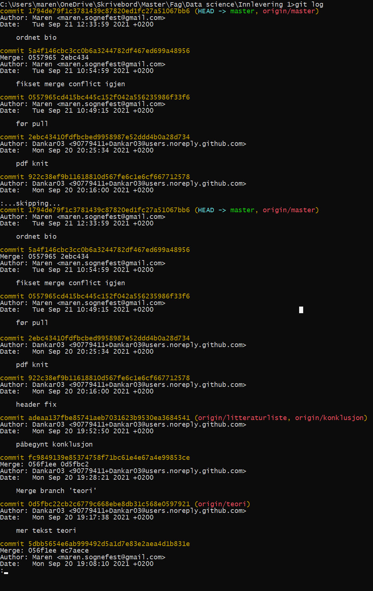

```{r -first chunk: Sessioninfo}
sessionInfo()
```
Her kjøres sessioninfo. Hvordan kan denne funksjonen hjelpe oss med å gjøre et dokument reproduserbart?


# Reproduserbarhet

I senere tid har det oppstått en **replikasjonskrise**. Denne startet innenfor psykologien, og ble for alvor offentlig kjent i 2015 da 270 forskere samarbeidet om å forsøke å replikere 100 studier som alle var publisert i ledende tidsskrifter innenfor fagfeltet. De klarte kun å få samme resultat i under halvparten av studiene, og dette var selv med hjelp fra forskerne som stod bak disse studiene @sætrevik2017. Det har senere vist seg at disse replikasjonsproblemene finnes innenfor flere fagfelt, og i ettertid har det blitt større fokus på reproduserbarhet innenfor forskning. Reproduserbarhet er en forutsetning for replikerbarhet, så denne oppgaven skal vi ta for oss reproduserbarhet og hvorvidt bruk av R og R notebooks kan være en mulig løsning for å gjøre forskning reproduserbar, og dermed mer pålitelig.

## Litteraturgjennomgang

Replikerbarhet/reproduserbarhet Det er enda ingen allmenn definisjon av "reproduserbarhet" og "replikerbarhet". Noen bruker disse begrepene om hverandre (Bollen et al., 2015), og andre er nøye med å skille dem fra hverandre (Leek and Peng, 2015: Goodman et al., 2016). I denne oppgaven vil vi skille begrepene tydelig fra hverandre og bruke @bollen2015 (et al., 2015) definisjoner av begrepene: "reproduserbarhet" oppstår dersom forskere klarer å komme frem til samme resultat ved å bruke samme prosedyre og samme datasett som gjort ved det opprinnelige studiet. "Replikerbarhet" oppstår dersom forskere klarer å komme frem til samme resultatet ved å bruke samme prosedyre og et nytt datasett. Hovedforskjellen er altså at ved "replikerbarhet" så skal det hentes inn nye data, men resultatet skal likevel bli det samme. De som prøver å replikere eller reprodusere studiet må altså ha tilgang til alt av data, kildekode og prosedyredetaljer. Man kan dermed si at reproduserbarhet er en betingelse for å kunne oppnå replikerbarhet.

### Problemets omfang

I lys av replikasjonskrisen og det økte fokuset på replikasjon, har flere tidsskrifter begynt å publisere tilhørende datasett sammen med artiklene.

### Vil dagens løsning med arkiv av data og eventuell programkode hos tidsskriftene kunne løse problemet?

Det er flere forskere o.l. som ikke ønsker å gi fra seg informasjon, dette gjelder data de besitter, koder, fremgangsmåte, dokumentasjon, resultat, feil, problemer de har møtt på, hypoteser osv. Dette gjør det svært vanskelig å reprodusere en tidligere studie, på et senere tidspunkt. Siden det samlet er flere problem, vil det naturligvis også være flere løsninger som må tas i bruk for at full reproduksjon skal være oppnåelig og man skal komme frem til lignende konklusjoner med ny data og ny sammensetning.

Vi kan definere og skille mellom tekniske og menneskelige løsninger. Det menneskelige aspektet i problemstillingen er ofte knyttet til det forskerne selv velger å dele av data, informasjon, koder, hypoteser, fremgangsmåte, programvare og så videre. Det har ikke vært praktisert, og standard retningslinjer for hva som bør ansees som god forskningsskikk og praksis er nødt å komme på plass for å møte kravene om tilfredsstillende reproduksjon og replikasjon.
Det tekniske aspektet byr på mangel av data, koder, feil i programvare og feil som har oppstått underveis. Ved at man kan integrere og implementere programkode hos tidsskriftene, synlig eller usynlig, så skal det være mulig for andre forskere å reprodusere studien og gjøre den replikerbar. 

#### Oversikt over hva som bør sendes til tidsskriftene:
* En kode til å  kune lese inn dataen med
* En kode til å kalkulere og analysere dataen
* En kode for å teste i henhold til hypoetese
* En kode for å generere en rapport av resultatet

### Mulig løsning 

I henhold til @gentleman2005 er det nøye å integrere koder og beregninger som blir brukt i dataanalyser, metodebeskrivelser og simuleringer. Dette kan enkelt gjøres via et kompendium, hevdet av @gentleman2005. Kompendium er en kortfattet oversikt over hovedinnholdet i f.eks. en studie gitt i dette tilfellet. Kompendiumet til da gi en oversikt over innholdet, slik som tekst, kode, data, metodikk, hypotese, problemstilling og så videre. Dette gjør at kompendiumet enkelt kan distribueres i ulike kanaler, enkelt kan håndteres og oppdateres i henhold.

Før var det RMarkdown som oftest ble brukt. Problemet der var at man ofte ikke fikk all tekst, data og koding i samme dokument, man måtte dele det opp i ulike tabs.
RNotebook er den nyeste utgivelsen fra Rstudio.  
Rstudio er en Integrated Developer Environment (IDE) for alt som er R relatert. Rstudio er gratis, både å laste ned og gratis å bruke. Man kan laste det ned lokalt på PC/Desktop eller jobbe online/remote. Alle vanlige operativ system (OS) skal være kompatible til å bruke Rstudio, bla. Mac, Windows, Linux.
Rstudio må benyttes sammen med andre program og/eller extensions, f.eks GitAhead, GitHub Desktop, kommandolinje/terminal, for å kunne oppnå reproduserbarhet og replikerbarhet. Dette oppnås f.eks med kodeversjonskontroll, f.eks Git koblet med Github. En RNotebook er et RMarkdown dokument som inneholder kode+tekst-blokker, som henter inn koder og data, utfører beregninger og analyser i henhold til formler/kode som legges inn i Rmd filen. RNotebook vil da kunne vise oss et ferdig, vanlig tekstdokument, som inneholder tekst og koder for relevant innhold, istedenfor å ha dette i flere forskjellige filer. Dette gjør at du visuelt kan vurdere dataene mens du utvikler RMarkdown dokumentet uten å måtte «knyte» sammen hele dokumentet for å se resultatet.

Dette gjør at RNotebook kan brukes til å løse problemer knyttet til reproduserbarhet og replikerbarhet.

### Vil dagens løsning med arkiv av data og eventuell programkode hos tidsskriftene kunne løse problemet?

En mulig løsning på problemet kan være å publisere forskningsartikler i kompendier, som også inneholder datasett og koder som er brukt i forskningen. I et slikt kompendium kan det være dokumenter som kan oppdateres, også kjent som dynamiske dokumenter. I Rstudio kan man lage dynamiske dokumenter som blander tekst og R-kode. Et slikt dokument består av "text chunks" og "code chunks", altså bolker med både ren tekst og koding.

## Analyse

Med riktig bruk av R Notebook kan problemet med reproduserbarhet løses. Dette dokumentet er skrevet i R studio, og det meste her er tekst, men som tidligere nevnt er fordelen med R Notebook at man kan blande bolker med tekst, sammen med bolker av koder. Når man laster ned pakker i Rstudio får man med noen dataset, som man kan bruke til å øve seg. Et av disse datasettene heter "cars" og code chunksene under henter data fra dette settet. Den først koden viser hvor langt den lengste bilen i datasettet kjørte.

```{r}
max(cars$dist)
```


I følge Florian @markowetz2015 er det følgende fem egoistiske hovedgrunner til at forskerne selv burde ønske å publisere reproduserbar forskning:

1.  Man unngår katastrofer

    -   som replikasjonskrisen innenfor for eksempel psykologi

2.  Det er lettere å skrive artikler

    -   ved å hele tiden kunne se hvordan man har kommet frem til resultatet i studiet, vil det være lettere å skrive artikler

3.  Lettere for fagfeller å forstå tankegangen

    -   ved å dele informasjon om datasett, koder osv. vil fagfeller lettere forstå hvordan du har tenkt

4.  Det muliggjør kontinuitet i arbeidet

    -   det vil for eksempel ikke være noe stort problem dersom forskeren har glemt fremgangsmåten vedkommende brukte i forskningen sin i fjor. Det vil være muligheter for å kunne se hvordan man har tenkt og jobbet med studiet

5.  Hjelper deg å opparbeide et godt rykte

    -   Andre vil se på en forsker som publiserer reproduserbarforskning som en troverdig og grundig forsker, og dersom det noen gang blir problemer med noe av arbeidet, vil det være enkelt å vise og forklare hvordan man har tenkt og jobbet

Er økt reproduserbarhet noe som vil tvinge seg frem eller er dagens økte interesse bare et blaff? Kan reproduserbarhet ha relevans i sektorer utenfor akademia?

## Konklusjon

Vi kan konkludere med at RNotebook bidrar til å gjøre det mulig å reprodusere, replikere og generalisere et studie, dette ved hjelp av en dynamisk RMD fil som inneholder både data, koder, fremgangsmåte, resultat og referanser, som igjen produserer docx-, tex- og html-versjoner. 
Noe som kan by på hodebry og problemer er alle programmene, extensions og Git som skal kommunisere sammen. Dette bidrar til et uoversiktlig bilde i starten, og for de som skal ta det i bruk krever det en bratt læringskurve.
Det man kan trekke frem som positivt for en forsker som skal ta dette i bruk er at man kan referere til logikk og utregninger direkte i dokumentet. Det viser hva som ligger bak og er ikke bare en visuell presentasjon. Om forskere da inkluderer alt av data, koder, fremgangsmåte og full utredelse for hva som har blitt gjort så vil dette kunne brukes av alle til å forstå og kunne brukes i en senere studie, eller bare brukes som en referanse i en ny studie/forskningsrapporter. 
Man bør ha flere retningslinjer og krav til hva man bør inkludere når man publiserer nye studier/rapporter/undersøkelser, dette vil bidra til økt standard for fremtidig bruk.

## Litteraturliste

Sætrevik, B. (2017). Replikasjonskrisen. *Psykologtidsskriftet.* <https://psykologtidsskriftet.no/fagessay/2017/07/replikasjonskrisen>

Schmidt, M. L. 2015. Reproducible Research Using RMarkdown and Git through Rstudio. *RPubs by Rstudio.* <https://rpubs.com/marschmi/105639>

Markowitz, F., Five selfish reasons to work reproducibly. *Genome Biology, 16*(1) 274. <https://genomebiology.biomedcentral.com/articles/10.1186/s13059-015-0850-7>

Gentleman, R. & Lang, D. T. Statistical analyses and reproducible research. *Journal of Computational and Graphical Statistics, 16*(1) 1-23. <https://www.tandfonline.com/doi/abs/10.1198/106186007X178663>

Litteraturliste ved bruk av
# References

<div id="refs"></div>

# Appendiks


