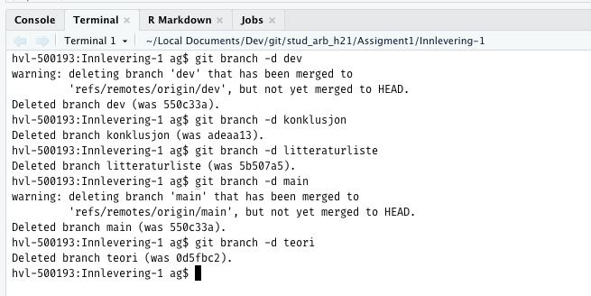

Kjekt at dere valgte å skrive på norsk for det brakte frem i lyset et par ting som må gjøres for at systemet skal virke optimalt med R Notebooks som benytter norsk som språk.
Jeg har laget et felles dokument, for helle gruppen, som tar for seg disse problemene.

Jeg synes det er et flott lite dokument dere har fått til.
Enkelte problemstillinger kunne selvsagt vært mer utdypet, men det var ikke hovedpoenget her.
Jeg synes også at dere gir en fin kortfattet oversikt over problemet og hvordan RNotebooks kanskje kan være en løsning.

Dere ser også ut til å ha gjort utstrakt bruk av git/github.
Bra!

Jeg foreslår følgende endringer:

-   Jeg foreslår å flytte resultatet av `sessionInfo()` til et appendiks.
-   Jeg forslår å bruke norske anførselstegn (alt+shift+v og alt+shift+b på mac)
-   Jeg har flyttet alle overskriftene et nivå opp s.a. øverste nivå er Heading 1 og ikke Heading 2. Husk at her formaterer vi ut fra logikk og ikke utsende. Vi kan eventuelt i ettertid endre formateringsvalget slik at Heading 1 blir i en mindre skriftstørrelse, men generelt vil jeg ikke anbefale dette. Default er som regel et fornuftig valg.
-   Jeg endret en overskrift slik at dokumentet begynner med *Innledning.*
-   Har også skiftet fra **fet** til *kursiv* for uthevet tekst som er mer i samsvar med typografisk tradisjon.

I tillegg har jeg slettet grener som ikke lengre er i bruk.
Det gjør det litt lettere å få oversikt over prosjektet.

